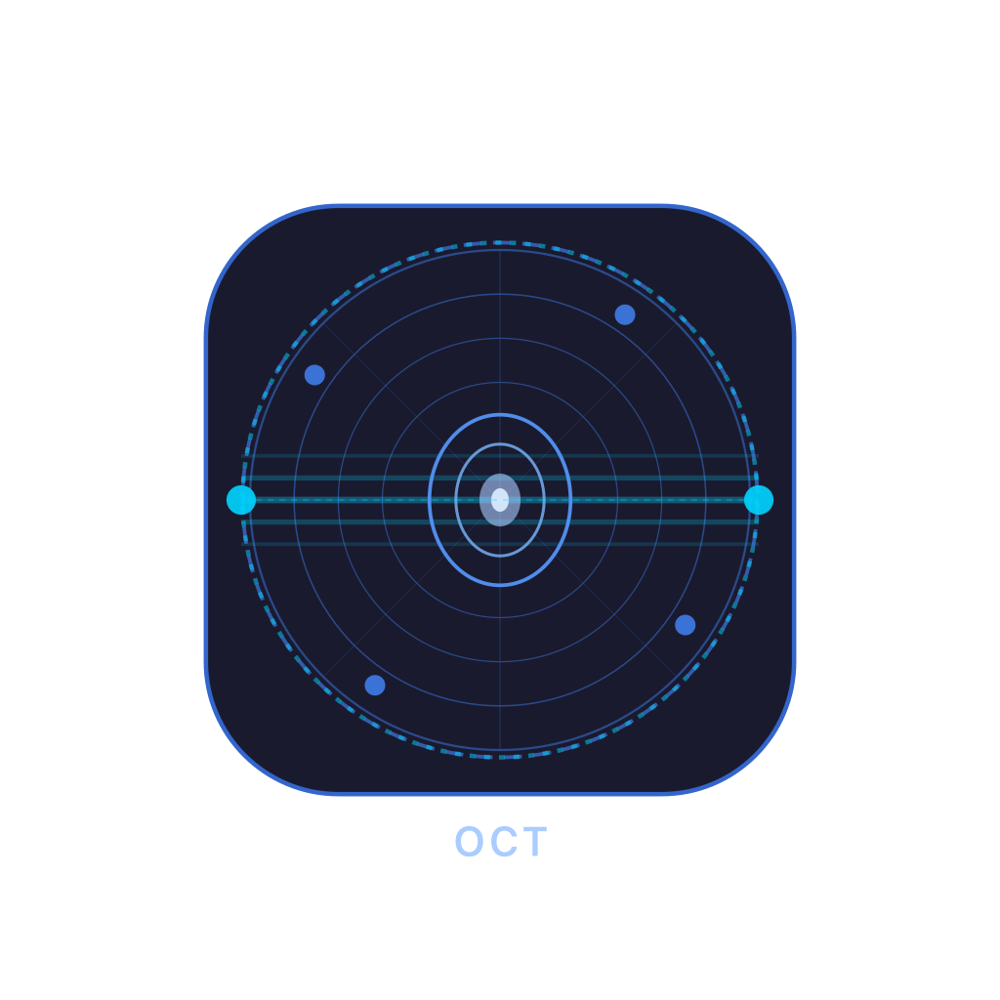

# Optical CT Dosimetry

A research system for 3-D optical CT dosimetry of radiochromic gel dosimeters.  A Raspberry Pi streams camera images over HTTP; a PyQt6 desktop app on the control machine drives the stepper motor and lamp, captures projections, reconstructs a 3-D attenuation volume with filtered back-projection (FBP), and extracts a depth dose profile.



---

## System architecture

```
Raspberry Pi                          Control machine (macOS)
─────────────────────────────         ──────────────────────────────────────
picamera2                             oct_app.py  (PyQt6)
  └─ camera_server.py  (Flask)  ◄──►    camera HTTP client
                                        stepper motor  ◄──► USB serial
                                        lamp           ◄──► FT232H USB adapter
```

The Raspberry Pi and control machine must be on the same network.  The Pi's IP address is configured in the app at runtime.

The app includes a live camera preview (refreshed every 2 s from the Pi) and a lamp toggle button.  During a scan the lamp is controlled automatically: off for dark frames, on for flat and projection captures, and left on when the scan finishes so the dosimeter remains visible.

---

## Repository contents

| File / directory | Purpose |
|---|---|
| `oct_app.py` | Main application — GUI, scan workers, FBP reconstruction, depth dose |
| `camera_server.py` | Flask HTTP server running on the Raspberry Pi; wraps `picamera2` |
| `camera-server.service` | systemd unit file to auto-start the camera server on the Pi |
| `launch_oct.sh` | Convenience launcher for the desktop app (activates conda env) |
| `lamp_control.py` | CLI utility to toggle the lamp via FT232H; used for manual testing |
| `motor_control.py` | CLI utility to jog the stepper motor; used for manual testing |
| `live_preview.py` | Standalone camera preview script |
| `capture_calibration_shots.py` | Captures ChArUco calibration images for lens correction |
| `charuco_board.py` | Generates the printable ChArUco calibration board |
| `compute_calibration_settings.py` | Computes lens distortion coefficients from calibration images |
| `test_calibration_settings.py` | Verifies computed calibration on a test image |
| `camera_calibration_charuco.json` | Saved camera intrinsics and distortion coefficients |
| `pipeline_timer.py` | Lightweight timing utility used during development |
| `raw_test.py` | Sanity-check script for raw picamera2 capture |
| `generate_user_guide.py` | Generates `optical_ct_user_guide.pdf` |
| `optical_ct_user_guide.pdf` | Printed user guide for first-time users |
| `charuco_5x5_25mm_A4.pdf` | Printable ChArUco calibration board (A4, 25 mm squares) |

---

## Setup

### Raspberry Pi (camera server)

1. Install dependencies:
   ```bash
   pip3 install flask picamera2
   ```

2. Copy the systemd service file and enable it:
   ```bash
   sudo cp camera-server.service /etc/systemd/system/
   sudo systemctl enable camera-server
   sudo systemctl start camera-server
   ```
   The server listens on port 5000 and starts automatically on boot.

### Control machine (macOS)

1. Create and activate the conda environment:
   ```bash
   conda create -n oct python=3.11
   conda activate oct
   ```

2. Install Python dependencies:
   ```bash
   pip install PyQt6 numpy opencv-python scikit-image matplotlib \
               pandas openpyxl requests pyserial
   pip install Adafruit-Blinka adafruit-circuitpython-busdevice pyftdi
   ```

3. Launch the app:
   ```bash
   ./launch_oct.sh
   # or directly:
   conda activate oct && python oct_app.py
   ```

---

## Camera calibration

Lens distortion is corrected at capture time using a pre-computed calibration stored in `camera_calibration_charuco.json`.  To recalibrate:

1. Print `charuco_5x5_25mm_A4.pdf` on A4 paper and attach it flat to a rigid backing.
2. Capture calibration images from multiple angles:
   ```bash
   python capture_calibration_shots.py
   ```
3. Compute the distortion coefficients:
   ```bash
   python compute_calibration_settings.py
   ```
4. Verify the result:
   ```bash
   python test_calibration_settings.py
   ```

---

## Scan output layout

Each scan is stored under `scans/<name>/`:

```
scans/
└── scan_20260506_143450/
    ├── pre/                  # Raw intensity projections (pre-irradiation)
    ├── post/                 # Raw intensity projections (post-irradiation)
    ├── subtracted/           # ΔA = A_post − A_pre projections (uint16 PNG) + encoding.json
    ├── calibration/          # Dark and flat frames captured at scan time
    ├── reconstruct/          # FBP volume, crop preview, sanity-check figure
    ├── depth-dose/           # Depth dose plot, Excel table, recon config (includes dose centroid offset)
    ├── dose-profiles/        # Per-slice radial dose profile PNGs + dose_profiles.xlsx
    ├── rotation_offset.json  # Measured pre/post dosimeter rotation and the correction applied
    └── scan_meta.json        # Acquisition parameters, and the dates of both sessions
```

---

## Physics notes

Optical density change between pre- and post-irradiation scans:

```
ΔA = A_post − A_pre = log(I_pre / I_post)
```

The flat-field term cancels exactly, making the measurement independent of lamp intensity drift between sessions.

After the post scan and before subtracting, the app measures how far the dosimeter was rotated about the vertical axis between the two sessions, corrects for it, and tells the operator what it did. The dosimeter is removed and reseated between sessions, so this happens; left uncorrected it stops static structure (above all the vial wall) from cancelling, and the residual dominates the reconstruction.

Δφ comes from matching whole projection profiles between the two stacks and taking the frame shift that fits best. Matching full profiles rather than a summary statistic is what makes it usable on a real scan: the post frames contain dose that the pre frames do not, and any single moment of the profile (a centroid above all) is pulled off by that extra absorbance. The fit uses absolute rather than squared difference, because bubbles come and go between sessions and a squared metric lets those few localised discrepancies dominate: on synthetic scans with different bubbles in each session, squared error chose a rotation eight steps wrong where absolute error was one step out. The correction is applied by pairing pre frame `i` with post frame `i + shift`, so every pair is two frames that were actually captured, never an interpolation. It therefore resolves Δφ only to a whole step, at most half a step out.

The mount fixes the dosimeter in every degree of freedom except rotation about the vertical axis, so the rotation match alone decides whether the answer is trusted (`confident` in `rotation_offset.json`). It requires one rotation to fit clearly better than the rest, measured as `match_separation_sigma`. A dosimeter that is rotationally symmetric about the axis carries no rotational information and fails this, which is self-limiting: with nothing to align, there is correspondingly little to misalign.

`residual_lateral_px` measures any sideways offset left after the correction. The mount rules this out, so it is not a confidence gate; it is a cheap canary for stage, camera or lamp drift, logged for whoever maintains the rig rather than raised at the operator, who cannot act on it.

The centroid sinusoid is still fitted, as `delta_phi_phase_deg`, for a sub-step cross-check. It is informational and never overrides the profile match.

`ROTATION_MATCH_MIN_SIGMA` and `ROTATION_MAX_LATERAL_PX` are calibrated on synthetic scans and may want adjusting against real data.

Before reconstruction each projection is masked to the gel.  ΔA is zero by construction outside the dosimeter (those rays miss it) and inside the glass (glass does not darken), so anything measured there is misregistration residual, and the vial wall is the sharpest, highest-contrast edge in the frame.  On a real scan that residual reached ±1.08 OD against a gel signal of about 0.1, and it survives whatever the rotation correction does, because a dosimeter seated at a different distance from the axis cannot be aligned by any rotation.  Setting those columns to their known-true value of zero is a support constraint, not cosmetic smoothing: on `scan_20260702_101800` it cut the reconstructed wall ring by 55x while leaving the gel interior unchanged.

The walls are found per frame as the darkest sustained column either side of the axis, and the kept span covers both scans' walls since they need not agree.  If no wall is found in either frame that projection is left unmasked and the count is logged.  `vial_seating.json` records how far the vial orbited the axis in each session, which is the usual explanation when the rotation match fails.

Pre and post frames are paired by the rotation angle in the filename, not by sort order, so two scans that used a different starting angle or step size cannot be silently mismatched.  Pixels where either frame reads below `MIN_VALID_COUNTS` (10 counts) are masked to ΔA = 0: down there the log ratio is quantisation noise, and a frame reading zero would otherwise produce a spurious ~14 OD spike at the vial wall.

ΔA projections are encoded as 16-bit PNG in offset binary, `value = (ΔA + 4) × 65535 / 8`, covering −4 to +4 OD.  Negative ΔA is kept rather than clipped, because clipping at zero rectifies noise and gives zero-dose regions a positive DC offset after FBP.  The range is sized from the bound the count mask imposes: with pixels below `MIN_VALID_COUNTS` discarded and a flat field of at most 255 counts, `|A|` cannot exceed `log(255/10) ≈ 3.2`, so ±4 OD cannot clip.  This matters because a bubble present in the pre scan and gone by the post scan produces a large negative ΔA; earlier −1 and −2 OD floors both clipped it.

The encoding is recorded in `subtracted/encoding.json` as explicit scale and offset values, so scans written under any earlier version still decode correctly.  Scans with no sidecar at all are read with the original unsigned `OD_SCALE = 65535 / 4` scheme.

Camera frames are transported and stored as 16-bit (`counts × 256`), preserving the sub-count precision that frame stacking buys.  The camera server still serves 8-bit unless asked for `?depth=16`.

Reconstruction uses `skimage.transform.iradon` with a Hann filter.  The volume has dimensions `(depth_slices, extent_px, extent_px)` with calibrated scales:

- Lateral: 43 mm / 454 px ≈ 0.095 mm/px
- Depth: 0.1 mm/slice

The dose centroid is auto-detected from the brightest 20 % of slices in the sample ROI, ranked by a high percentile rather than the slice mean (with a beam this small the mean of a slice is background, so the mean would rank slices by artefact content).  A guard band of `DOSE_EDGE_GUARD_FRAC` is excluded at each end of the sample region first: the meniscus and the base of the vial throw strong artefacts, and without a guard they simply win.  On a real scan the first slice ran 1139 % above the column median, which made the brightest slices the edge ones and put the dose centroid on the meniscus.  Locating the beam within that map takes two steps, both needed because the beam is under 2 % of the slice area at 10 mm across on a 66 mm grid:

1. The vial wall is excluded (`gel_interior_mask`).  Whenever it fails to cancel it is the brightest thing in the slice, and being concentric with the rotation axis its centroid sits dead centre, which drags a whole-slice centroid to the middle however hard the map is thresholded.  No dose is deposited in the glass, so excluding it costs nothing.
2. The threshold is taken at half the peak above local background, the usual FWHM convention.  Being a contrast ratio rather than an area, it needs no assumption about beam size: it locates a 3 mm beam and a 10 mm one equally well.  The peak is read at the 99.9th percentile, not the maximum, so a single hot pixel cannot define it.

This previously thresholded at the median of the whole slice, which kept half the pixels, so roughly 96 % of the weight came from undosed background and the centroid tracked artefacts rather than the beam.

`BEAM_DIAMETER_MM` (10 mm, an upper bound) is not used to find the beam, only to sanity-check it: if the region found is wider than a beam that size could be, the log says the centroid has probably locked onto an artefact and the depth dose should not be trusted.  The region must also be round: the beam is specified by a diameter, so synthetic beams measure 1.00 to 1.01 elongation, and `DOSE_CENTROID_MAX_ELONGATION` rejects anything more than half again as long as it is wide.  Width alone accepted an elongated 9.7 x 6.4 mm smear on a real scan.  The width is measured from the spread of the weight about its centroid, not from its area.  Area only gives a width if the region is a single blob, and on a real scan it was not: 4479 scattered pixels read as 7.2 mm by area while actually spanning 41 mm of gel.  The comparison is by diameter rather than area for the same reason, since a 3x area margin quietly allows a 1.7x wider region.

The depth dose baseline is a low percentile of the profile (`DOSE_BASELINE_PERCENTILE`), not the mean of the end slices.  With an edge artefact inside that averaging window the baseline came out so high that 77.5 % of a real depth dose clipped to exactly zero, which reads as an absence of dose rather than as clipping.

The centroid offset is stored in `depth-dose/recon_config.json` as `dose_centroid_x_mm` and `dose_centroid_z_mm`:

- **X** — left/right displacement as seen in the camera image (negative = left of axis)
- **Z** — front/back displacement along the camera line of sight (negative = closer to the camera than the rotation axis)

---

## User guide

A printable step-by-step guide for first-time users is at `optical_ct_user_guide.pdf`.  To regenerate it after changes:

```bash
python generate_user_guide.py
```
